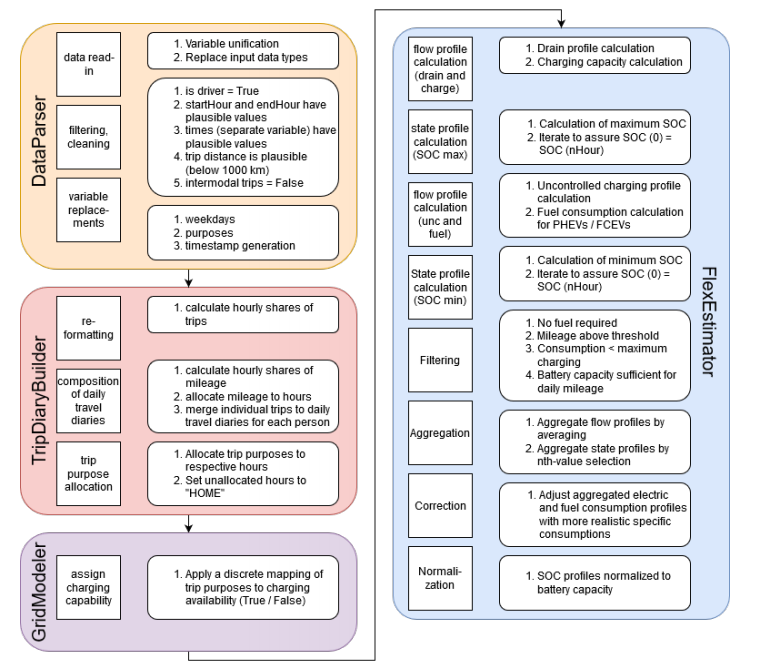

..  VencoPy introdcution file created on September 15, 2020
    by Niklas Wulff
    Licensed under CC BY 4.0: https://creativecommons.org/licenses/by/4.0/deed.en
    
.. _architecture:

Architecture documentation
===================================

General structure of the framework
---------------------------------------------------

The figure below shows the detailed VencoPy components in a developer diagram. The four components - implemented as 
Python classes - DataParser, TripDiaryBuilder, GridModeler and FlexEstimator can be clearly distinguished. A fifth 
component, Evaluator, used to create the plots for this work is not shown in the figure as it is not needed to calculate 
results from VencoPy. A brief description of the classes is presented below. For a more detailed algebraic description 
of the tool please refer to the :ref:`publications` section.

Interface to the dataset: DataParser class
^^^^^^^^^^^^^^^^^^^^^^^^^^^^^^^^^^^^^^^^^^^^^^^^^^
The first step in the VencoPy framework for being able to estimate EV energy
consumption implies accessing a travel survey data set, such as the MiD. This is
carried out through a parsing interface to the original database. In the parsing interface
to the data set, three main operations are carried out: the read-in of the travel survey trip
data, stored in .dta or .csv files, filtering and cleaning of the original raw data set and
a set of variable replacement operations to allow the composition of travel diaries in a
second step.
In order to have consistent entry data for all variables and for different data sets,
all database entries are harmonised, which includes generating unified data types and
consistent variable naming. The naming convention for the variables and their respective
input type can be specified in the VencoPy-config file. Of the 22 variables, four variables are used for indexing, 11 variables
characterize the trip time within the year, two variables are used for filtering and five
variables characterize the trip itself. The representation of time may vary between travel
surveys.
Most travel surveys include motorised, non motorised as well as multi-modal trips.
We only select trips that were carried out with a motorized individual vehicle as a driver.
Similarly, trips with missing (e.g. missing tripID, missing start or end time etc.) or
invalid information (e.g. implausible trip distance) are filtered out. Filters can be easily
adapted to other travel survey numeric codes via the config-file.
By applying a set of filters, the initial database
is subset to only contain valid entries representing motorised trips. The last operation in
the parsing of raw travel survey data sets is a harmonization step.

Daily travel diary composition: TravelDiaryBuilder class
^^^^^^^^^^^^^^^^^^^^^^^^^^^^^^^^^^^^^^^^^^^^^^^^^^^^^^^^^^^^
In the second VencoPy class, the travelDiaryBuilder, individual trips at the
survey day are consolidated into person-specific travel diaries comprising multiple trips
(carried out by car).
The daily travel diary composition consists of three main steps: Reformatting
the database, allocating trip purposes and merging the obtained dataframe with other
relevant variables from the original database.
In the first step, reformatting, the time dimension is transferred from the raw data
(usually in minutes) to the necessary output format (e.g. hours). Each trip is split
into shares, which are then assigned to the respective hour in which they took place,
generating an hourly dataframe with a timestamp instead of a dataframe containing
single trip entries.
Similarly, mileages driven and the trip purpose are allocated to their respective
hour and merged into daily travel diaries. Trips are assumed to determine the respective
person’s stay in the consecutive hours up to the next trip and therefore are related to
the charging availability between two trips. Trip purposes included in surveys may
comprise trips carried out for work or education reasons, trips returning to home, trips
to shopping facilities and other leisure activities. Currently, trips whose purpose is not
specified are allocated to trips returning to the own household.
At the end of the second VencoPy component TripDiaryBuilder, two intermediary
data sets are available either directly from the class within Python or from the hard-drive
as .csv files. The first one comprises mileage travel diaries d(v, t) and the second one
comprises parking place types derived from trip purposes parkingType(v, t).

Charging infrastructure allocation: GridModeler class
^^^^^^^^^^^^^^^^^^^^^^^^^^^^^^^^^^^^^^^^^^^^^^^^^^^^^^^^^^^^^^^^^^^^^^
The charging infrastructure allocation makes use of a basic charging infrastructure
model, which assumes the availability of charging stations when vehicles are parked.
Since the analytical focus of the framework lies on a regional level (NUTS1-NUTS0), the
infrastructure model is kept simple in the current version.
Charging availability is allocated based on a binary TRUE/FALSE mapping to
a respective trip purpose in the VencoPy-config. Thus, different scenarios describing
different charging availabilities, e.g. at home or at home and at work etc. can be distinguished, but neither a regional differentiation nor a charging availability probability or
distribution are assumed.
At the end of the application of the GridModeler, a given parking purpose diary
parkingType(v, t) is transferred into a binary grid connection diary connectgrid (v, t) with
the same format but consisting only of TRUE/FALSE values.

Flexibility estimation: flexEstimator class
^^^^^^^^^^^^^^^^^^^^^^^^^^^^^^^^^^^^^^^^^^^^^^^^^^
There are three integral inputs to the estimation:
1. a profile describing hourly distances for each vehicle
2. a boolean set of profiles describing if a vehicle is connected to the grid at a given
hour
3. techno-economic input assumptions
After some filtering and iteration steps, this yields the minimum and maximum battery constraints.
After these steps, six profiles are provided to the user: a battery drain profile (the electricity that flows out of the
vehicle battery each hour for driving), a charging capacity profile (the maximum electricity available
for charging in each hour), a minimum and a maximum SoC (upper and lower limits for the battery SoC), an
uncontrolled charging profile (the electricity flow from grid to vehicle when no control is exerted) and a
fuel consumption profile.

The first four profiles can be used as constraints for other models to determine
optimal charging strategies, the fifth profile simulates a case, where charging is not
controlled an EVs charge as soon as a charging possibility is available. Lastly, the
sixth profile quantifies the demand for additional fuel for trips that cannot be only by
electricity.

Quality values
---------------------------------------------------

.. list-table:: Quality values
   :widths: 35, 65
   :header-rows: 1

   * - Value priority
     - Description
   * - 1. Learnability
     - The highest priority of VencoPy is to provide an easy-to-apply tool for scientists (not primarily developers) to estimate electric vehicle fleets' load shifting potential. Hence, easy to understand approaches, code structures and explicit formulations are favored.
   * - 2. Readability
     - The readability of the code, especially the linear flow structure of the main VencoPy file should be preserved. Source code and equations should be easy to read and understand. Splitting of statements is favored over convoluted one-liners. Significant learnability improvements (e.g. through an additional library), may motivate a deviation from this principle. 
   * - 3. Reproducibility
     - The model has to be deterministic and reproducible both on the scientific and on the technical level. Hence, all example and test artifacts have to be part of the git repository. Source code revisions should be used to reference reproducible states of the source code. 
   * - 4. Reliability
     - The software has to operate without crashes and should terminate early, if scientific requirements are not met. Testing and asserting expectations in code is encouraged. However, in its alpha-version no special error catching routines are implemented.
   * - 5.Performance
     - Performance is not a high priority, since runtimes are quite quick. However, basic performance considerations like efficient formulation and application of libraries and algorithms should be considered. 

Organizational information
---------------------------------------------------

.. list-table:: requirements
   :widths: 35, 65
   :header-rows: 1

   * - Requirement
     - Context
   * - Software Engineering Team (SET)
     - Niklas Wulff, Fabia Miorelli, Benjamin Fuchs
   * - Stakeholders
     - Hans Christian Gils, Department of Energy Systems Analysis at Institute of Networked Energy Systems, DLR
   * - Timeline
     - Alpha release in Q4 2020, Beta release in Q3 2021, for further releases planned, see :ref:`releaseTimeline`
   * - Open source ready
     - Features, dependencies and components which are contraindicative or at odds with an open source publication should not be used
   * - Development tools
     - Source code and all artefacts are located in the DLR GITLAB repository for VencoPy including the software documentation. For development, the PyCharm community edition IDE and gitbash are used. For graphical depictions of software components and similar documentation draw.io is used.

