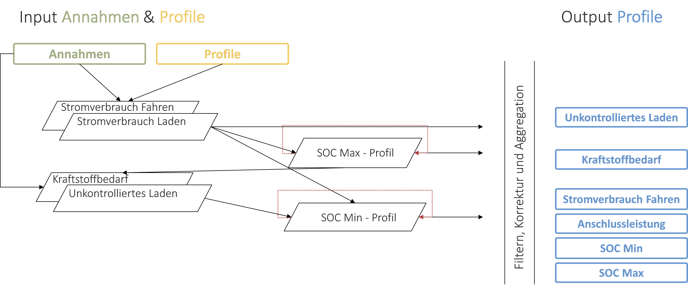

..  VencoPy introduction file created on February 11, 2020
    by Niklas Wulff
    Licensed under CC BY 4.0: https://creativecommons.org/licenses/by/4.0/deed.en
    
.. _intro:

Introduction
===================================

Future electric vehicle fleets pose both challenges and opportunities for power systems. While increased power demand from transport electrification necessitates expansion of power supply, vehicle batteries can to a certain degree shift their charging load to times of high availability of power. The model-adequate description of power demand from future plug-in electric vehicle fleets is a pre-requisite for modelling sector-coupled energy systems and drawing respective policy-relevant conclusions. Vehicle Energy Consumption in Python (VencoPy) is a tool that provides boundary conditions for load shifting and vehicle-to-grid potentials based on transport demand data and techno-economic assumptions. It has so far been applied to the German travel survey (Mobilität in Deutschland) on a national scale to derive hourly load-shifting constraining profiles for the energy system optimization model REMix.

.. image:: figures/VencoPy_Schema.png
   :width: 600

Zukünftige Flotten elektrisch angetriebener Fahrzeuge sind sowohl Chancen als auch Risiken für Energiesysteme. Auf der einen Seite erfordert eine Elektrifizierung des Verkehrs einen ausgeweiteten Kraftwerkspark, auf der anderen Seite können Batterien in gewissen Grenzen eine Flexibilitätsoption für das Stromsystem darstellen. Die angemessene Beschreibung der Stromnachfrage zukünftiger elektrischer Plug-in-Fahrzeugflotten ist eine Voraussetzung für die Modellierung sektorgekoppelter Energiesysteme und die Bereitstellung politikrelevanter Erkenntnisse. Vehicle Energy Consumption in Python (VencoPy) ist ein Tool, das Randbedingungen für das Ladeverhalten und möglicher Vehicle-to-Grid Potenziale basierend auf Mobilitätsdaten und techno-ökonomischen Annahmen berechnet. Es wurde bisher auf die deutsche Verkehrserhebung "Mobilität in Deutschland" angewendet, um den Einfluss des Nutzerverhaltens auf das zukünftige Lastverschiebepotenzial und dessen Auswirkungen auf das deutsche Stromsystem zu untersuchen. 

